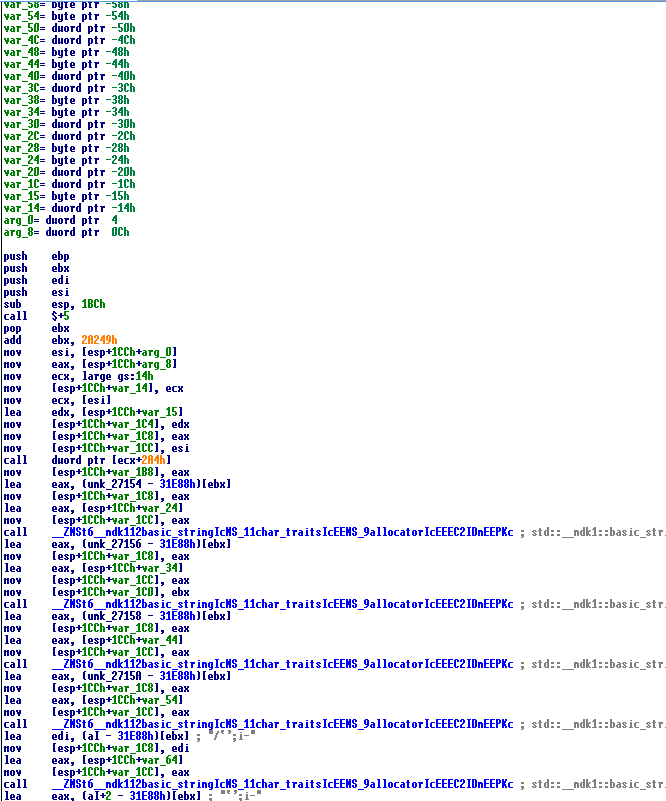
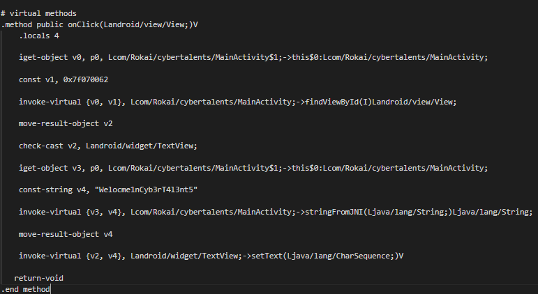

# Write up 

first using apktool to extract files and decompile dex file to smali , we end up with this directoy : 

 
 
  
nothing interesting at AndroidManifest  , lets look at smali files , the file MainActivity contains the first functionality of the application , its just calling <b> LoalLibrary </b> to Load a native Library included on the apk m then printing the String <b> "Welcome To Rockai Challenge" </b>
 
 

 
 
Then there is the MainActivity$1 that will include the main functionality of the applciation  
this is the ghidra Decompilation  :   

 
This function tries to do a query to <b>content://com.rokai2.contentprovider/pwd</b>  to extract a a string <b>("Welocme1nCyb3rT4l3nt5")</b> from a column in a database then it will pass that string to the native function <b> stringFromJNI </b>  which will return the flag , the query will fail because there is no content://com.rokai2.contentprovider/pwd
  lets take a look at stringFromJNI (this function will be in the native library loaded ) :   

  
So this library is a C++ compiled Binary , this function is a bit  long , it s doing some binary operations with a hardcoded bytes array and the parameter passed to it  we can reverse this function and get our flag since we have the parameter passed ("Welocme1nCyb3rT4l3nt5") , also we can change the smali code by removing all that query content so that the function will not fail , this is how i changed the smali code :    

