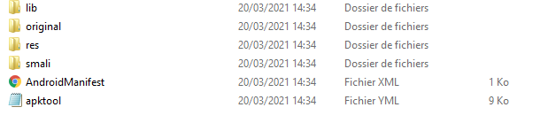
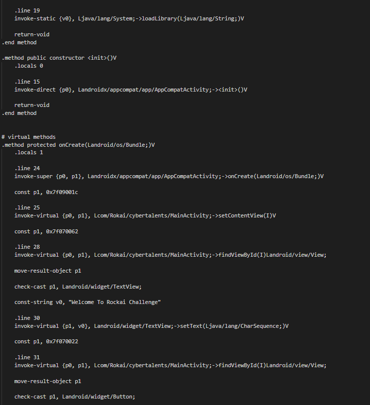
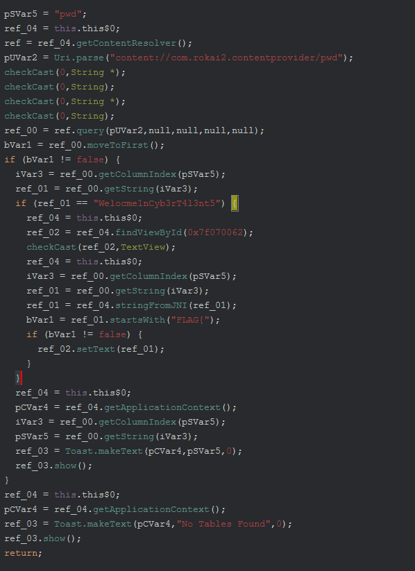

# Write up 

first using apktool to extract files and decompile dex file to smali , we end up with this directoy : 

 
 
  
nothing interesting at AndroidManifest  , lets look at smali files , the file MainActivity contains the first functionality of the application , its just calling <b> LoalLibrary </b> to Load a native Library included on the apk m then printing the String <b> "Welcome To Rockai Challenge" </b>
 
 

 
 
Then there is the MainActivity$1 that will include the main functionality of the applciation  
this is the ghidra Decompilation  :  

