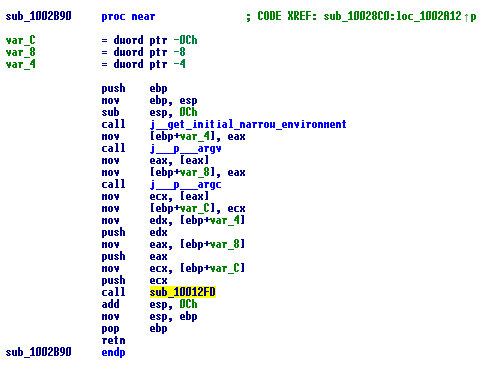
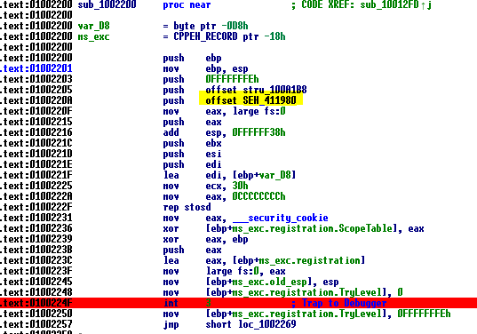
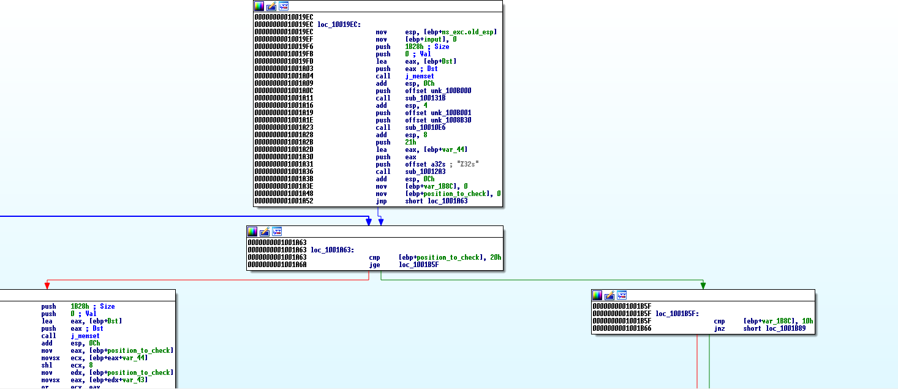
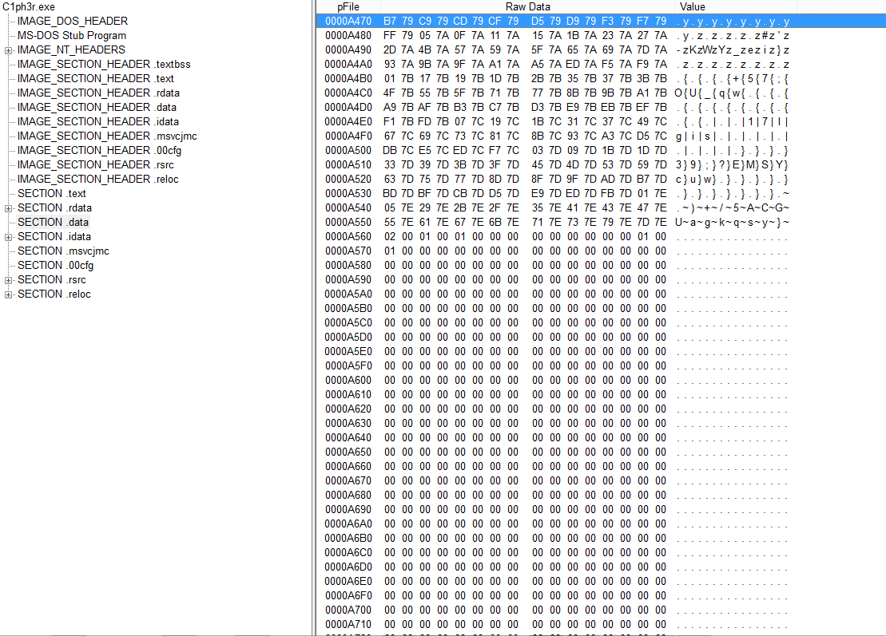

# Write up 

Lets start ,  opening our executable on IDA , after passing all the initialization code of the process this should be our "main" called in sub_10012FD    
 
  
There is a jump after that call to this function    
    
This function implements the INT 3  <b> anti debugging </b> technique , it will change the SEH chain (fs:0) so when there is an interrupt exception (INT 3 ) it will jump to that function at adress 0x411980 okey lets see what we have at that location , another trap again but just after that  trap we find this function , so maybe this is our Code that checks for the flag 
    
 
 after reversing this function i found that at each iteration it concats 2 caracters of the flag as a hex number and do the prime number factorization and store the  exponents of the factorization in an array in  after that it checks if the stored exponents in the data section match the ones computed , so i extracted the exponents , the prime numbers found and did the inverse operation   
 this is the the exponents and the primes in the data section   
 
